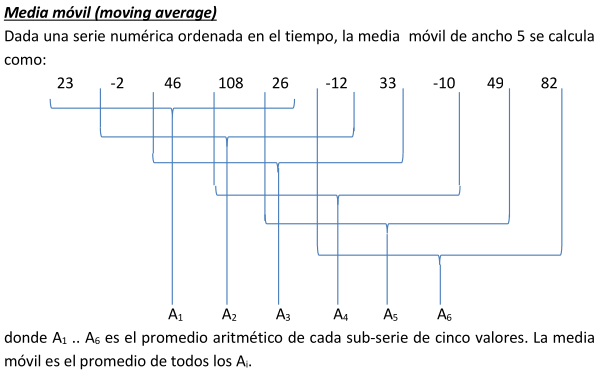

# Conceptos y aplicaciones en Big Data

## Práctica4-Hadoop MapReduce

---

### 1) El siguiente job en MapReducepermite contabilizar cuantas palabras comienzan concada una de las letras del abecedario.

```
def map(key, values, context):
	words = values.split()
	for w in words:
		context.write(w[0], 1)

def reduce(key, values, context):
	c=0
	for v in values:
		c=c+1
	context.write(key, c)
```

- **a. Solucione el problema del “case sensitive” usando comparadores.**
- **b. ¿Cuántos reducers se ejecutan en este problema? Sabiendo que se cuenta con el doble de nodos para la tarea de reduce ¿Cómo podría usarlos comparadores para aprovechar todos los nodos?**

En este caso, la clave es la primera letra de cada palabra. Eso significa que habrá como máximo 26 claves diferentes (a–z). Por lo tanto, se ejecutará un reducer por cada letra presente en los datos. Si el dataset solo tiene palabras con 10 letras distintas, entonces habrá 10 reducers efectivos; si están las 26 letras, serán 26.

**¿Cómo podría usar los comparadores para aprovechar todos los nodos?**

Si contamos con el doble de nodos de reduce (más de los 26 posibles), algunos quedarían ociosos porque no hay más de 26 claves naturales. Para aprovecharlos, se puede:

* **Particionar las claves en sub-claves**, por ejemplo transformar la letra `A` en `(A,0)` y `(A,1)` según un criterio (hash, posición, etc.).
* Usar un **comparador de Shuffle** que considere equivalentes todas las sub-claves con la misma letra (`A0` y `A1` se agrupan luego como “A”), pero que en la fase de distribución permita repartir la carga entre distintos reducers. De esta forma, se paraleliza más el trabajo y luego se consolidan los resultados parciales.

---

### 2) ¿Qué operaciones de resumen realizadas por los reducers se ven beneficiados por la definición de funciones de comparación personalizadas? ¿Qué consideraciones habría que tener en cuenta relacionado con la tarea de los mappers?

* **GROUP BY + agregación** (ej. sumas, conteos, promedios).

  * Un comparador de *shuffle* puede agrupar claves equivalentes bajo un mismo criterio (ej. mayúsculas = minúsculas, agrupar por la primer letra, agrupar por ID de cliente sin importar el prefijo).
* **DISTINCT**.

  * Un comparador puede unificar tuplas que son “distintas en el valor crudo” pero equivalentes según un criterio (ej. “Juan Pérez” y “JUAN PÉREZ”).
* **JOINs**.

  * Comparadores son fundamentales: en *shuffle* garantizan que todos los registros con el mismo identificador vayan al mismo reducer; en *sort* permiten que lleguen ordenados de cierta manera (ej. primero el cliente y después sus cuentas).
* **Ordenamientos previos a agregados complejos**.

  * Por ejemplo, calcular mínimos/máximos o consolidar en orden temporal.

En general: **todo resumen que requiera agrupar o consolidar datos equivalentes bajo reglas distintas de la igualdad exacta de claves.**

#### ¿Qué consideraciones habría que tener en cuenta relacionado con la tarea de los mappers?

* **Definición de la clave intermedia**:
  El mapper debe emitir las claves de forma consistente con el criterio que luego aplicarán los comparadores.
  Ejemplo: si el comparador de shuffle agrupa por la primer letra, el mapper debe emitir como clave la palabra o un prefijo de ella.
* **Etiquetado para joins**:
  En joins 1:1 o 1\:n es clave que el mapper agregue etiquetas (“C” para cliente, “CA” para caja) porque el comparador por sí solo no distingue el origen.
* **Minimizar datos**:
  Emitir solo lo necesario (filtrado y proyección) para no sobrecargar shuffle/sort.
* **Consistencia en el formato**:
  Si se usan claves compuestas (tuplas), el mapper debe respetar esa estructura (ej. `(“C”, id_cliente)` vs `(“CA”, id_cliente)`).

---

### 3) ¿La operación de inner join mejora su performance con la función combiner?

No, la operación de **inner join** no mejora su performance con la función **combiner**.

**Razón**

* El **combiner** solo sirve cuando la función de reducción es **asociativa y conmutativa** (ej. `SUM`, `COUNT`, `MAX`, etc.), porque permite resumir valores localmente en cada nodo antes de mandarlos al shuffle.
* En un **inner join**, el reducer necesita recibir **todos los registros de ambas tablas con la misma clave** para poder emparejarlos.
* Si un combiner “juntara” o filtrara datos en el mapper, correría el riesgo de descartar registros que en otro nodo tenían su par → se rompería el join.

**Conclusión**

El join requiere la totalidad de los datos asociados a una clave, por lo que **no es seguro ni útil aplicar un combiner**.
El combiner se aprovecha en operaciones de **resumen numérico**, pero no en **joins**.

---

### 4)Muchos cálculos aritméticos necesitan ordenar una serie de números para obtener su resultado, como por ejemplo la mediana.

**La mediana es el "número en el medio" de una lista ordenada de números.**

**3, 5, 7, 12, 13, 14, 21,23, 23, 23, 23, 29, 39, 40, 56**

**Implemente una solución MapReduce que permita calcular la mediana de una serie de valores. Use como prueba el dataset website para calcular la medianadel tiempo de permanencia.**

La mediana requiere:

1. **Contar la cantidad total de elementos (N)**.
2. **Ordenar los valores numéricos**.
3. Conocer el índice central:

   * Si N es impar → elemento en posición $(N+1)/2$.
   * Si N es par → promedio de los elementos en posiciones $N/2$ y $N/2+1$.

En MapReduce:

* Un primer job calcula N.
* Un segundo job ordena los valores y calcula la mediana usando N como parámetro.

---

### 5) Implemente una solución MapReduce para el método de Jacobi utilizando el dataset jacobi2 y los valores iniciales están en un dataset con el formato:

| incognita_i | valor |
| ----------- | ----- |
| var1        | 1     |
| var2        | 2     |
| var3        | 3     |

**Nota: En esta solución los valores de las incógnitas NO pueden ser pasados por parámetros a los mappers y reducers. Deben ser recibidos como una entrada del job.**

---

### 6) Implemente una solución MapReduce que permita crear el dataset con valores iniciales arbitrarios para Jacobi. Suponiendo que hay 1000000 de variables ¿Cómo optimizaría la creación de todos los valores aprovechando la capacidad de paralelismo del paradigma?

**Nota: Piense como entrada del job un único archivo con un único valor: el número de variables que hay que crear.**


---

### 7) Dado el datasetBanco (visto en teoría) el cual está compuesto por tres datasets:

- Cliente: <ID_Cliente, nombre, apellido, DNI, fecha de nacimiento, nacionalidad>
- CajaDeAhorro: <ID_Caja, ID_Cliente, saldo>
- Prestamos: <ID_Caja, cuotas, monto>
- Implemente una solución MapReduce para resolver las siguientes consultas SQL describiendo el DAG correspondiente.

```
a.
SELECT nacionalidad, Count(*) AS cuantos
FROM Cliente AS C INNER JOIN CajaDeAhorro AS CA
ON C.ID_Cliente = CA.ID_Cliente
INNER JOIN Prestamos AS P
ON CA.ID_Caja = P.ID_Caja
GROUP BY nacionalidad
ORDER BY cuantos DESC
LIMIT 1*
```

```
b.
SELECT (Year(fecha_nacimiento)%100) AS decada,
Avg(saldo)
FROM ClienteAS C INNER JOIN CajaDeAhorro AS CA
ON C.ID_Cliente = CA.ID_Cliente
WHERE nacionalidad = “ITA”
GROUP BYdecada
```

```
c.
SELECT nombre, apellido, DNI
FROMCliente AS C INNER JOIN CajaDeAhorro AS CA
ON C.ID_Cliente = CA.ID_Cliente
WHERE C.ID_ClienteIN
(SELECTID_Cliente
FROM CajaDeAhorro AS CA INNER JOIN
Prestamos AS P ON CA.ID_Caja = P.ID_Caja
GROUP BY ID_Cliente
HAVING Count(*) > 2 )
AND Year(fecha_nacimiento) < 2000
GROUP BY C.ID_Cliente
HAVING Max(saldo) > 500000
```

---

### 8) El banco almacena en un cuarto archivo (llamado Movimientos) todas las transacciones realizadas y las almacena con este formato:

**<ID_Caja, monto, timestamp>**
Donde para cada caja de ahorro almacena en un determinado timestamp (en formato AAAA-MM-DD HH:mm:SS) el monto del movimiento (puede ser negativo o positivo según si se hizo una extracción o un depósito).
Implemente una solución en MapReduce que permita calcular para cada cliente del banco su media móvil (moving average) en un mes y año determinado. Tanto el año, como el mes yel anchode la ventana deben ser parámetros de la consulta.

